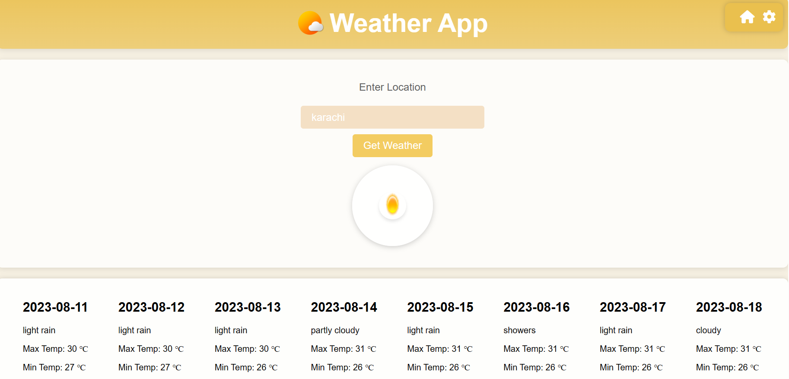

# Weather App 🌈🌦️

Welcome to the Cute Weather App repository! This charming web application brings you weather forecasts with a delightful and whimsical design that'll warm your heart.

## Features
- Adorable user interface with playful styling.
- Easily fetch weather data by entering a location.
- Responsive design for optimal viewing on various devices.
- Accurate weather information fetched via RapidAPI.
- Weather icons to visually represent different weather conditions.

## Getting Started
Open the index.html file in your web browser to start using the app.

## Usage
Enter a location in the input field and click "Get Weather" to retrieve weather data.
The app will present the weather forecast, showing the date, weather description, maximum temperature, and minimum temperature.

## Technologies Used
HTML
CSS (with Font Awesome for icons)
JavaScript
RapidAPI for weather data

## Credits
Weather icon: IconArchive

Feel free to contribute, offer suggestions, or report any issues you encounter. Happy coding! 🚀🌟
